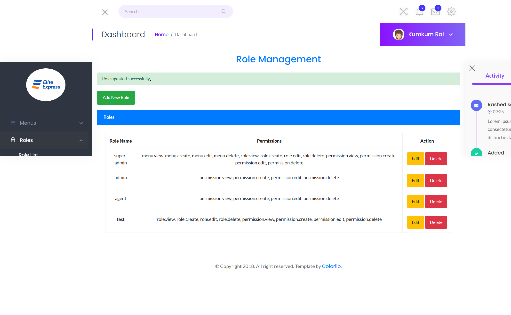
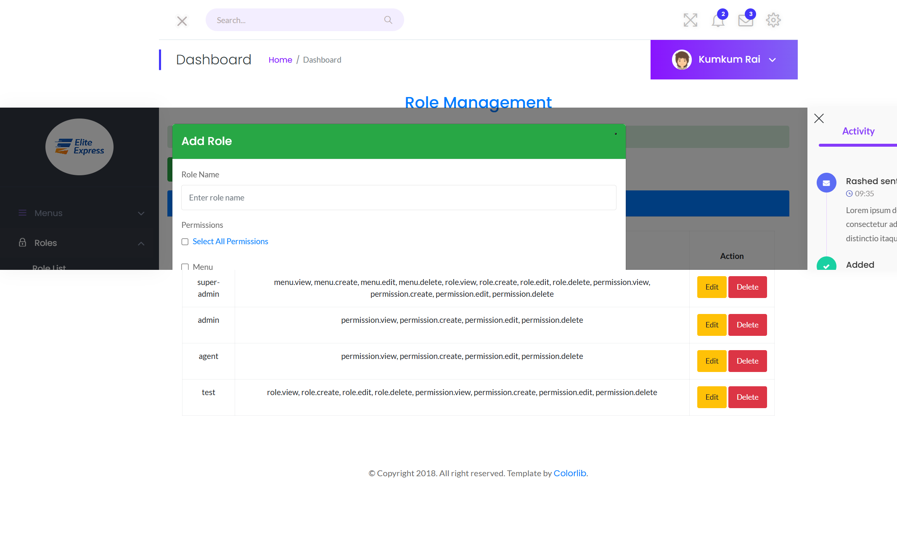
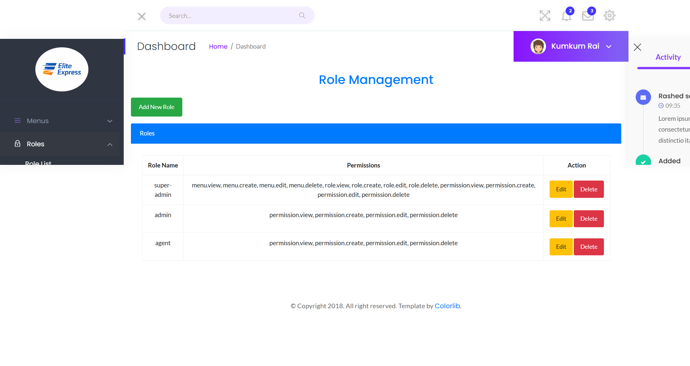
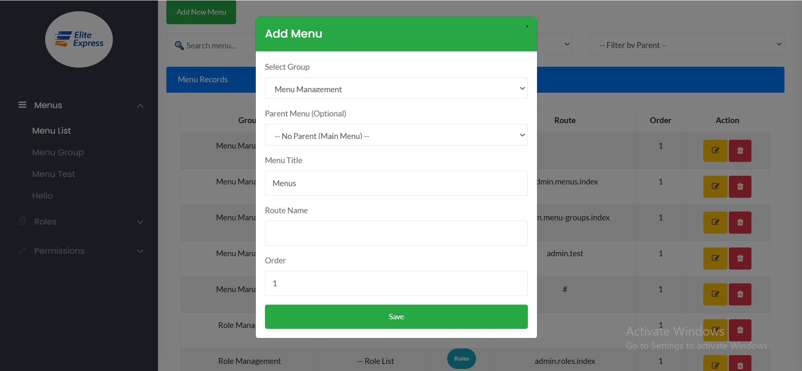

# Laravel Dynamic Menu, Role & Permission Management

A robust and dynamic Role-Based Access Control (RBAC) system built with **Laravel 11**, **Spatie Permission**, and **AJAX**. This project allows administrators to manage menus, roles, and permissions dynamically with a clean and interactive UI.

## 🚀 Features

* **Dynamic Menu Management:** Create, edit, and delete menus with parent-child relationships.
* **Role Management:** Add/Edit roles with a group-wise permission selection interface.
* **Permission Management:** Group-based permissions (e.g., Menu, Role, Dough, Preps).
* **Dynamic UI interactions:** * Select "All" permissions with one click.
    * Group-wise toggle (e.g., Clicking 'Menu' parent selects `menu.view`, `menu.create`, etc.).
* **AJAX Driven:** All CRUD operations (Create, Read, Update, Delete) are handled via AJAX for a seamless user experience.
* **Spatie Permission Integration:** Backend security powered by the industry-standard Spatie package.

---

## 📸 Screenshots

### 1. Dynamic Role Management
View and manage all system roles and their assigned permissions.


### 2. Permission Overview
Detailed list of all system permissions grouped by category.


### 3. Role Updated Successfully
Real-time feedback using AJAX and sweet alerts.


### 4. Add/Edit Role Modal
Interactive modal with Parent-Child checkbox logic for permissions.


### 5. Role Management Dashboard
A clean administrative overview.


### 6. Dynamic Menu Creation
Easily build your sidebar or navigation menu dynamically.


---

## 🛠️ Technology Stack

* **Backend:** Laravel 11
* **Security:** Spatie Laravel-Permission
* **Frontend:** Bootstrap 5, jQuery
* **Database:** MySQL
* **Interactions:** AJAX (Axios/jQuery)

---

## 📥 Installation

1. **Clone the repository:**
   ```bash
   git clone [https://github.com/haidercse/dynamic_menu_role_permission.git](https://github.com/haidercse/dynamic_menu_role_permission.git)
   cd dynamic_menu_role_permission
